```{r setup, include=FALSE}
options(htmltools.dir.version = FALSE)
knitr::opts_chunk$set(
  fig.width=9, fig.height=3.5, fig.retina=3,
  out.width = "100%",
  cache = FALSE,
  echo = TRUE,
  message = FALSE, 
  warning = FALSE,
  hiline = TRUE
)
library(knitr)
library(icons)
# source: https://github.com/gadenbuie/xaringanExtra
#xaringanExtra::use_animate_css()
#xaringanExtra::use_animate_all("slide_down")
xaringanExtra::use_scribble()
xaringanExtra::use_search(show_icon = TRUE)
xaringanExtra::use_tachyons()
xaringanExtra::use_webcam()
xaringanExtra::use_freezeframe()
xaringanExtra::use_tile_view()
htmltools::tagList(
  xaringanExtra::use_clipboard(
    button_text = "<i class=\"fa fa-clipboard\"></i>",
    success_text = "<i class=\"fa fa-check\" style=\"color: #90BE6D\"></i>",
    error_text = "<i class=\"fa fa-times-circle\" style=\"color: #F94144\"></i>"
  ),
  rmarkdown::html_dependency_font_awesome()
)
xaringanExtra::use_fit_screen()
xaringanExtra::use_extra_styles(
  hover_code_line = TRUE,         #<<
  mute_unhighlighted_code = TRUE  #<<
)
```

```{r xaringan-themer, include=FALSE, warning=FALSE}
library(xaringanthemer)
style_duo_accent(
  outfile = 'xaringan-themer-pt-br.css',
  primary_color = "#a79ebf",
  secondary_color = "#906068",
  link_color = "darkblue",
  inverse_header_color = "#FFFFFF",
  header_font_google = google_font("Josefin Sans"),
  text_font_google   = google_font("Montserrat", "300", "300i"),
  code_font_google   = google_font("Fira Mono")
)
# colors
  # primary_color = light_yellow,
  # secondary_color = dark_yellow,
  # header_color = gray,
  # text_color = gray,
  # code_inline_color = colorspace::lighten(gray),
  # text_bold_color = colorspace::lighten(gray),
  # link_color = blue,
  # title_slide_text_color = blue,
```

# Contexto

.pull-left[
* Sequenciamento de próxima geração (NGS) vem sendo utilizado com sucesso no contexto de pesquisas e acompanhamento de doenças infecciosas

    + Sequenciamento de genoma completo de patógenos
    
        + Alta resolução do conteúdo genético
        + Investigação do conteúdo de virulência, resistência, elementos móveis, etc.
        
    + Identificação de origens de epidemias
        + rastreamento de transmissões
        + Investigação da dinâmica

* Nova área: **Vigilância genômica**
]

???

* Atualmente, dados de sequenciamento de próxima geração vêm sendo utilizados com sucesso no estudo e controle de doenças infecciosas, o que vem dando origem a uma nova área chamada: vigilância genômica

* Esta se baseia no sequenciamento massivo dos patógenos para identificar origem de epidemias, rastrear transmissões, investigar suas dinâmicas, genes de virulência e resistência, etc.

--
.pull-right[
.bg-washed-blue.b--dark-blue.ba.bw2.br3.shadow-5.ph4.mt0[
Aplicação se tornando cada vez mais concreta durante a atual pandemia do Sars-CoV-2 
]
<br>
<br>
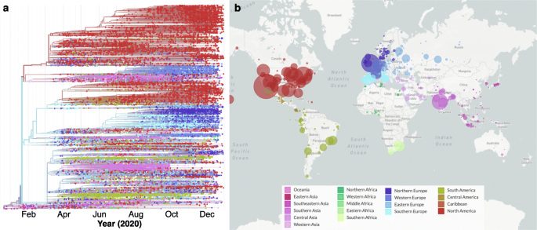
]

???

* Área e aplicação tem ganhado bastante força recentemente devido a sua importância durante a atual pandemia do novo coronavírus.

---

# Porém ...

* Apesar de sua relevância, a implementação destas práticas em meios clínicos permanece um grande desafio

* De maneira geral, as análises dependem bastante de habilidades e expertise em bioinformática.

    + Seleção da plataforma de sequenciamento

    + Seleção e instalação das ferramentas e recursos
    
    + Preparação dos dados
    
    + Execução da análise
    
    + Interpretação dos resultados

<br>
.bg-washed-blue.b--dark-blue.ba.bw2.br3.shadow-5.ph4.mt0[
Estas questões apresentam grande barreira para a implementação de rotinas de sequenciamento em ambientes clínicos
]

???

* Porém, apesar de sua grande relevância, sua implementação real em ambientes clínicos ainda é bastante difícil pois depende muito de expertise e habilidades em bioinformática.

---

class: middle, center, inverse

# Urgência por soluções de programas completos e abrangentes

???

* Por isso, tem-se hoje uma urgência por soluções abrangentes para a fácil análise de dados genômicos

---

# _Pipelines_ baseados em contêineres

.pull-left-bigger[

]

.pull-right-smaller[
<br>
* Para tentar mitigar estas barreiras, desenvolvemos 3 _pipelines_ sequenciais:

    + `r fontawesome("github")` [ngs-preprocess](https://github.com/fmalmeida/ngs-preprocess)
    + `r fontawesome("github")` [MpGAP](https://github.com/fmalmeida/mpgap)
    + `r fontawesome("github")` [bacannot](https://github.com/fmalmeida/bacannot)

* Adaptável a diferentes cenários
    + Illumina
    + Pacbio
    + ONT
]

???

* Para tentar mitigar estes problemas, nós desenvolvemos três pipelines:
  + Os dois primeiros para pré-processamento e montagem de dados de sequenciamento das plataformas Illumina, Pacbio e Oxford Nanopore. Estes realizam a análise e montagem _de novo_ de forma "organismo inespecífico" e podem ser aplicados para diferentes tipos de amostras.
  + E um pipeline de anotação bacteriana compreensivo que será detalhado um pouco mais na frente.
  + Quando utilizados de maneira sequencial, estes pipelines provêem uma ferramenta computacional robusta para a análise completa de genomas bacterianos.

---

# Implementação

.pull-left[
A implementação baseada em contêineres permite:

+ Portabilidade
    + Dependências empacotadas em `r fontawesome("docker")`, facilitando a instalação:
    + `docker pull <image>`
+ Reprodutibilidade
    + Nextflow assegura a execução do _pipeline_ para diferentes conjuntos de dados
+ Escalabilidade
    + Nextflow provê uma maneira simples de paralelizar e implementar trabalhos em qualquer máquina, de laptos a super computadores
+ Tolerância a erros
    + Nextflow rastreia cada processo e cria _checkpoints_ permitindo pontos de reinício em caso de erros
]

.pull-right[

**Distribuição**

* Pipelines disponíveis no github `r fontawesome("github")`
* Ferramentas empacotadas em imagens `r fontawesome("docker")` 

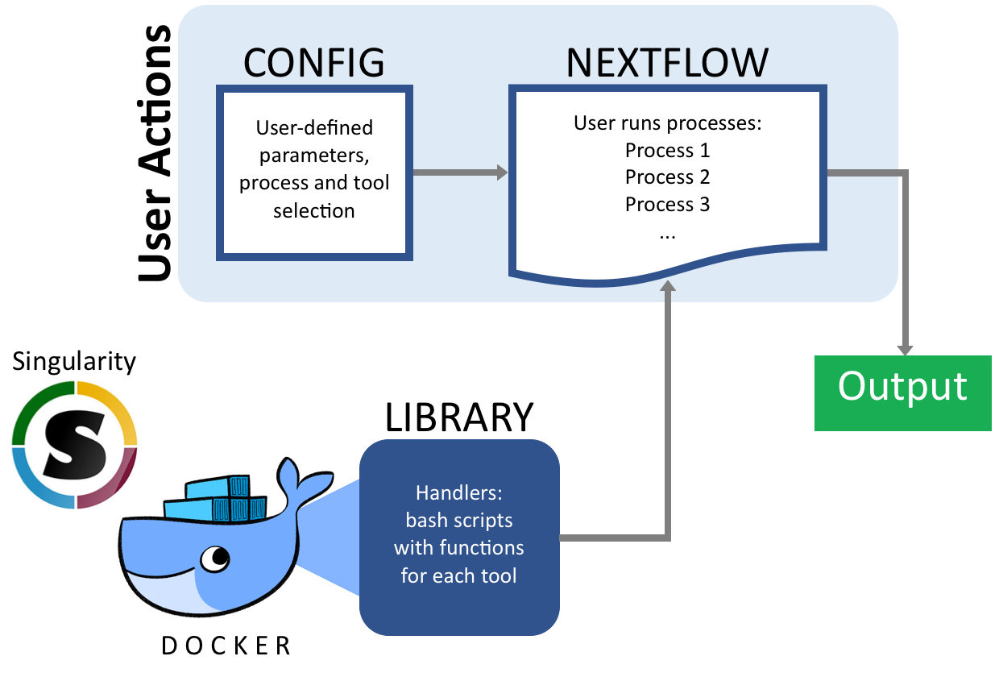

]

???

* Os pipelines foram implementados através de uma combinação entre Docker e Nextflow.
* O Docker garante alta portabilidade ao tornar desnecessária a instalação das ferramentas pois todas se encontram instaladas em imagens docker públicas que são baixadas de maneira automática pelo nextflow.
* E o nextflow garante reprodutibilidade, escalonabilidade por permitir fácil paralelização e utilização em HPCs e é extremamente tolerante a erros.

---

# Instalação e execução simplificadas

.pull-left[

* Os _pipelines_ são instalados e executados em comando único.

    + Parâmetros podem ser passados em linha de comando
    + Mas recomenda-se o uso de arquivos de configuração

```bash
nextflow run fmalmeida/ngs-preprocess -c config.txt
```

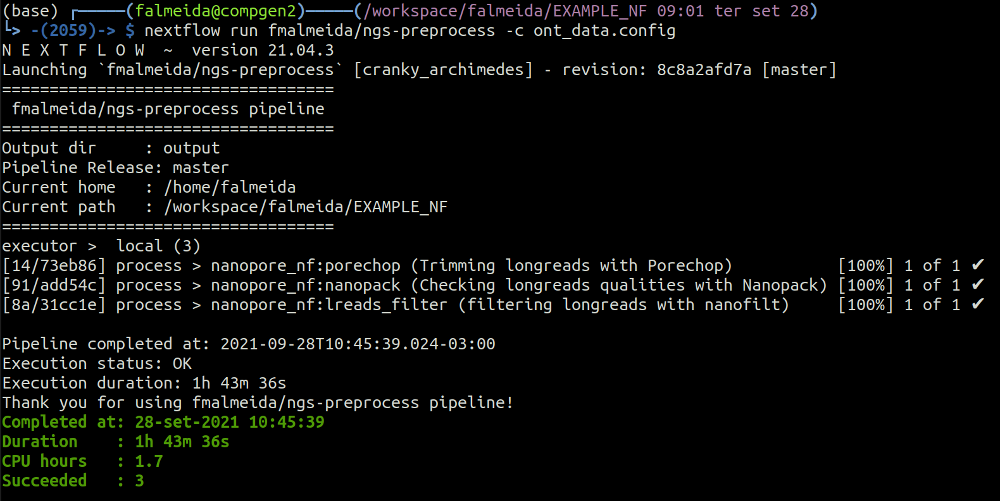

]

.pull-right[
* Arquivo de configuração

<br>
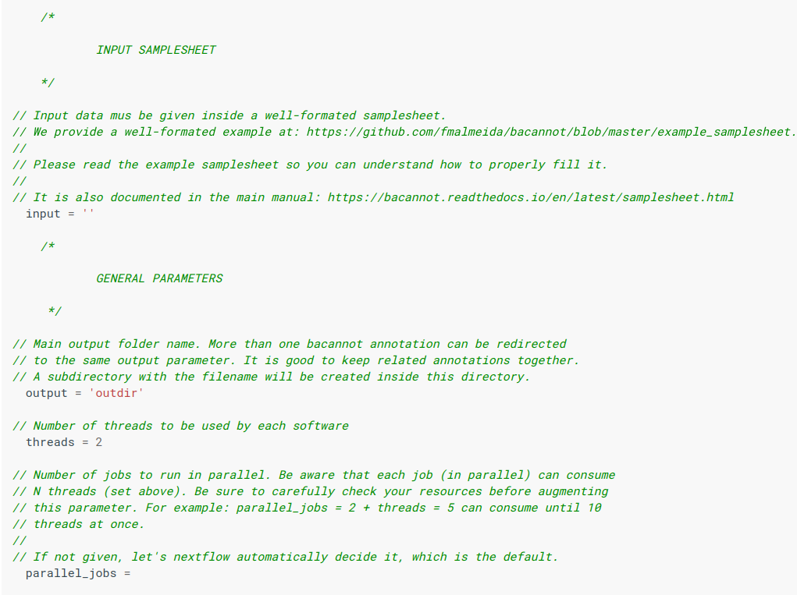
]

???

* Aqui podemos ver o quão simples é usar o pipeline. Através de um único comando, nextflow baixa o pipeline e suas imagens docker o oexecuta automaticamente.
* Todos os comandos podem ser passados pela linha de comando, porém, é distribuído com o pipeline um arquivo de configuração extremamente detalhado que facilita a configuração e torna sua execução mais concisa.

---

# Bacannot, _pipeline_ de anotação

.pull-left[
* Bacannot foi desenhado para ser bastante abrangente!

    + Mas modular
        + Análises podem ser "desligadas"
    
    + Escalonável de um a milhares de genomas
    
    + Relatórios claros e um aplicativo-web para exploração dos resultados
    
    + Muito bem documentado
        + https://bacannot.readthedocs.io/en/latest/

* Por ser escrito em módulos, pode rapidamente se adaptar a necessidades da comunidade:
    
    + Novos relatórios
    + Novas análises
    + Etc.
]


.pull-right[
<center>
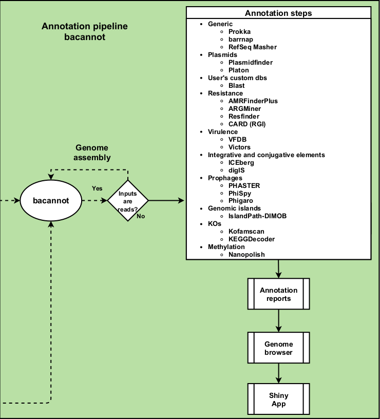
</center>
]

???

* O pipeline de anotação, bacannot, é um pipeline robusto e abrangente.
* Possui diversas etapas de anotações genéricas e especializadas como anotação de elementos genéticos móveis, metabótitos secundários, anotação funcional com ortologias KEGG, anotação de virulência e resistência, e muito mais.
* Esta abrangência torna o pipeline extremamente versátil e útil para a grande maioria de amostras bacterianas, clínicas ou ambientais, diferente da maioria dos pipelines existentes que são extremamente focados em aspectos de relevância clínica.
* Além disso, ele é implementado em módulos, o que permite a rápida adição de novas análises a depender da necessidade da comunidade.
* Tudo isso enquanto providenciando ótimas alternativas para a visualização, interpretação e interrogação dos resultados, o que facilita muito a vida de pessoas pouco familiarizadas com os tipos de dados. Como por exemplo:

---

# Bacannot: Relatórios

<center>
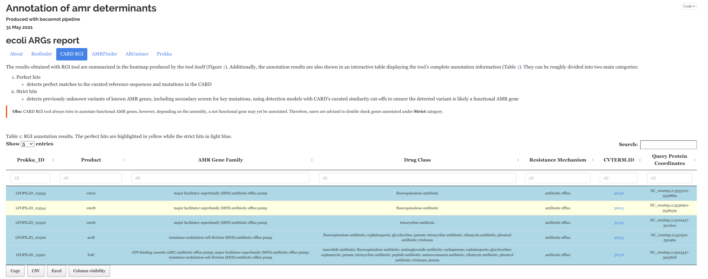
</center>

???

* Possui relatórios automatizados para cada uma das seções de anotação do pipeline. Aqui mostro o relatório de genes de resistência.

---

# Bacannot: Navegador genômico

<center>
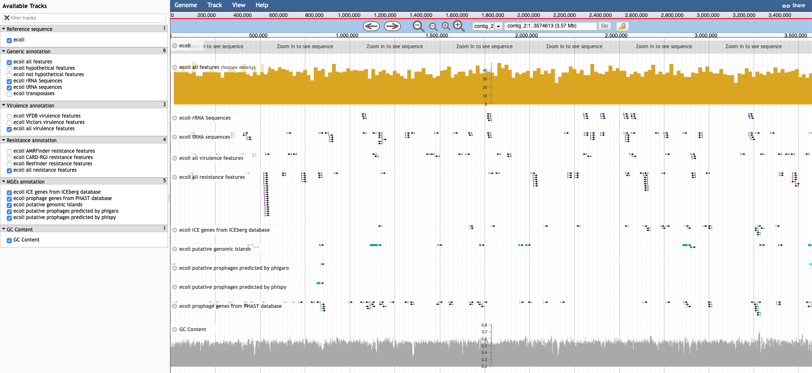
</center>

???

* Possui um navegador genômico para a visualização de todos os resultados de forma interativa ao longo do genoma.

---

# Bacannot: web (shiny) app

.pull-left-bigger[

]

.pull-right-smaller[
* Indexação dos relatórios de anotação

* Visualização do navegador genômico

* Exploração e interrogação dos resultados armazenados em SQL

* BLAST dinâmico:

    + Maneira tabular para identificação das posições e interseção com anotação
    
    + Para visualização do alinhamento com [SequenceServer](https://sequenceserver.com/)
]

???

* Possui também uma aplicação web que condensa todos os relatórios no mesmo lugar, além de providenciar uma maneira rápida e fácil de interrogar e filtrar os resultados da anotação, e também providencia de forma integrada a possibilidade de realizar um BLAST contra o genoma e verificar se as sequências analisadas possuem interseção com algum resultado da anotação.

---

# Trabalhos realizados

* Multidrug-Resistant (MDR) _Klebsiella variicola_ Strains Isolated in a Brazilian Hospital Belong to New Clones
    
    + https://doi.org/10.3389/fmicb.2021.604031

<center>
```{r, echo=FALSE, out.width="45%"}
knitr::include_graphics(c("IMAGES/fmicb-12-604031-g002.jpg","IMAGES/fmicb-12-604031-g003.jpg"))
```
</center>

???

* Para demonstrar a versatilidade do pipeline, eu trouxe alguns exemplos de trabalhos que foram realizados utilizando os resultados dos pipelines.

* O primeiro, foi a análise de 5 cepas de _K. variicola_ relevantes clinicamente a qual, com os resultados do pipeline, exploramos a conservação e relevância de genes de virulência considerados relevantes para a espécie atualmente.

---

# Trabalhos realizados

* A novel multidrug resistant, non-Tn4401 genetic element (NTEKPC)-bearing, strain type of _Klebsiella pneumoniae_ isolated from an urban lake with drinking and recreational water reuse 
    
    + https://www.frontiersin.org/articles/10.3389/fmicb.2021.732324/abstract

<center>
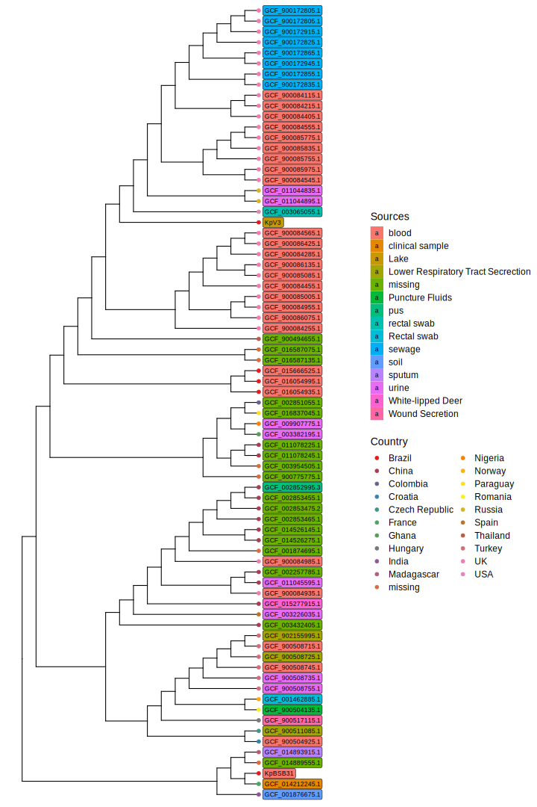 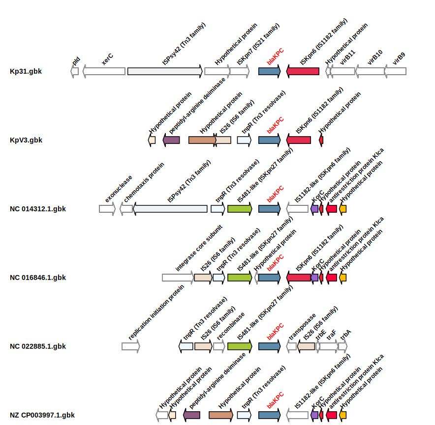
</center>

???

* O segundo, foi a análise de uma _K. pneumoniae_ ambiental na qual identificamos com os resultados do pipeline uma carbapenemase associada a um transposon que se mantém bem conservada ao longo de outras cepas de ambientes clínicos, indicando a movimentação deste gene e sua possível reserva em cepa ambiental.

---

# Trabalhos realizados

* Genomic and physiological characterization of _Novosphingobium terrae_ sp. nov., an alphaproteobacterium isolated from Cerrado soil
    
    + Em revisão (Spectrum)

<center>
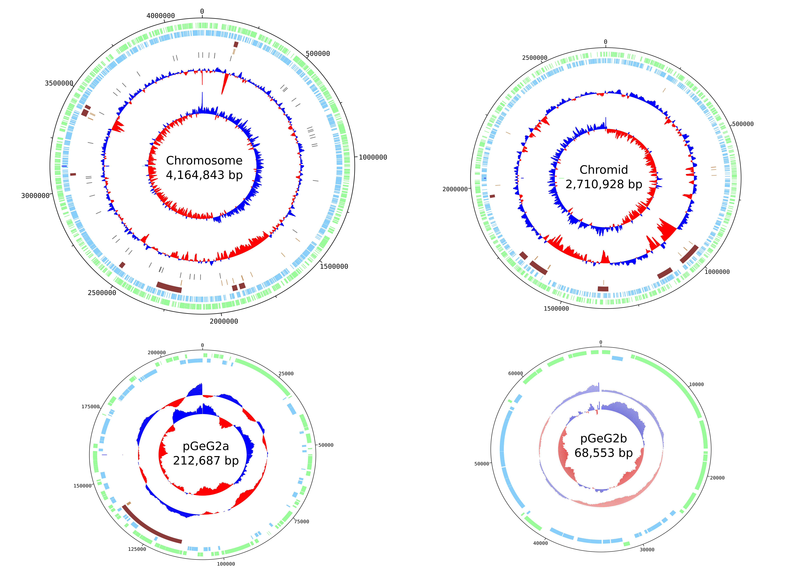 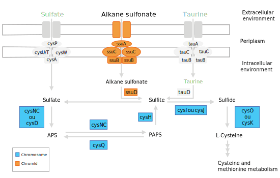
</center>

???

* O último, foi a análise de uma cepa de solo de cerrado que, através dos resultados dos pipelines e principalmente das anotações funcionais fizemos uma vasta caracterização genômica e fisiológica para compará-la com espécies próximas e propor uma nova espécie e a existência de um cromídeo nesta cepa.

---

# Perspectivas

* Criar um programa de **genômica comparativa** que receba os resultados do _pipeline_ de anotação

    + `bacannot-compare`
    + Pangenoma, filogenia, comparação de conteúdo funcional, resistência, STs, etc.

.pull-left[
<center>
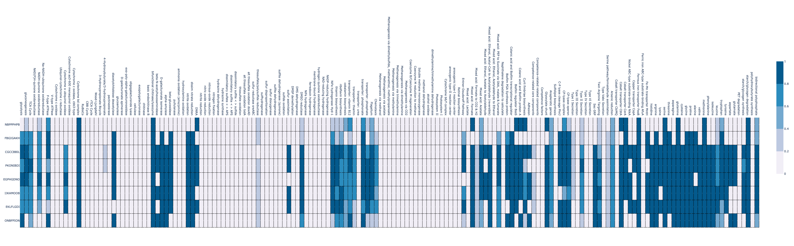
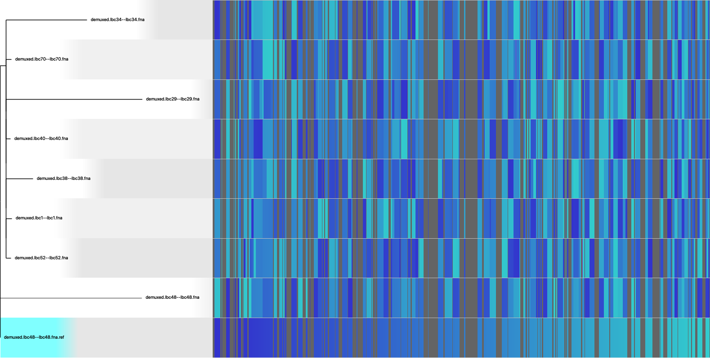
</center>
]

.pull-right[
<br>
<br>

```{r, echo=FALSE, out.width="30%"}
knitr::include_graphics(c("IMAGES/pangenome_frequency.svg", "IMAGES/pangenome_pie.svg", "IMAGES/pangenome_matrix.svg"))
```
]

???

* Como perspectivas principais para a segunda parte do doutorado nós temos:

  + Realizar a análise de 32 cepas isoladas no HuB que possuem contextos interessantes de fenótipos de resistência e virulência não usuais. Estas já fora mandadas para sequenciamento.
  + E, além disso, estamos também organizando para análise outras coleções bacterians em colaboração firmada com a UNAERP e o laboratório exame.
  + E produzir um programa de análise comparativa que seja capaz de interpretar os resultados obtidos pelo pipeline de anotação e, com eles, realizar diversas análises comparativas como: pangenoma, filogenia, resistoma, etc.

---
class: inverse, middle, center

# Obrigado!
