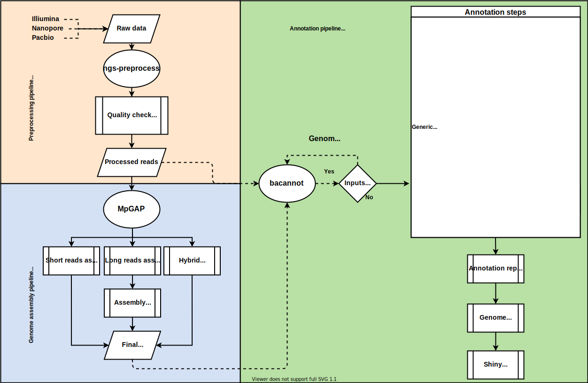

```{r setup, include=FALSE}
options(htmltools.dir.version = FALSE)
knitr::opts_chunk$set(
  fig.width=9, fig.height=3.5, fig.retina=3,
  out.width = "100%",
  cache = FALSE,
  echo = TRUE,
  message = FALSE, 
  warning = FALSE,
  hiline = TRUE
)
library(knitr)
library(icons)
# source: https://github.com/gadenbuie/xaringanExtra
#xaringanExtra::use_animate_css()
#xaringanExtra::use_animate_all("slide_down")
xaringanExtra::use_scribble()
xaringanExtra::use_search(show_icon = TRUE)
xaringanExtra::use_tachyons()
xaringanExtra::use_webcam()
xaringanExtra::use_freezeframe()
xaringanExtra::use_tile_view()
htmltools::tagList(
  xaringanExtra::use_clipboard(
    button_text = "<i class=\"fa fa-clipboard\"></i>",
    success_text = "<i class=\"fa fa-check\" style=\"color: #90BE6D\"></i>",
    error_text = "<i class=\"fa fa-times-circle\" style=\"color: #F94144\"></i>"
  ),
  rmarkdown::html_dependency_font_awesome()
)
xaringanExtra::use_fit_screen()
xaringanExtra::use_extra_styles(
  hover_code_line = TRUE,         #<<
  mute_unhighlighted_code = TRUE  #<<
)
```

```{r xaringan-themer, include=FALSE, warning=FALSE}
library(xaringanthemer)
style_duo_accent(
  primary_color = "#a3b6e1",
  secondary_color = "#445588",
  link_color = "darkblue",
  inverse_header_color = "#FFFFFF",
  header_font_google = google_font("Josefin Sans"),
  text_font_google   = google_font("Montserrat", "300", "300i"),
  code_font_google   = google_font("Fira Mono")
)
# colors
  # primary_color = light_yellow,
  # secondary_color = dark_yellow,
  # header_color = gray,
  # text_color = gray,
  # code_inline_color = colorspace::lighten(gray),
  # text_bold_color = colorspace::lighten(gray),
  # link_color = blue,
  # title_slide_text_color = blue,
```

# Contexto

* Sequenciamento de próxima geração (NGS) vem sendo utilizado com sucesso no contexto de pesquisas e acompanhamento de doenças infecciosas
* Dando início a uma nova área: *Vigilância genômica*

    + Sequenciamento de genoma completo de patógenos virais e bacterianos
    
    + Resolução sem prescedentes do conteúdo genético do patógeno
    
    + Identificação de origens de epidemias e rastreamento de transmissões
    
    + Investigação da dinâmica de epidemias
    
    + Identificação de conteúdo de virulência e resistência

???

* NGS data is being successfully used for the study and control of infectious diseases which is giving rise to a relatively new field called *Genomic surveillance*.

* The pillars of this filed is that the massive genome sequencing of pathogens enable the identification of outbreaks sources, track transmissions, investigate epidemic dynamics, investigate resistance and virulence traits, and more.

* All of that because of the high resolution genetic makeup of the pathogens provided by sequencing.

--

.bg-washed-blue.b--dark-blue.ba.bw2.br3.shadow-5.ph4.mt0[
Esta ideia está sendo reforçada devido a vigilância genômica que vem sendo relizada durante a pandemia do Sars-CoV-2 
]

---

# Porém ...

* Apesar de sua relevância, a implementação destas práticas em meios clínicos permanece um grande desafio

* De maneira geral, as análises dependem bastante de habilidades e expertise em bioinformática.

    + Seleção da plataforma de sequenciamento

    + Seleção e instalação das ferramentas e recursos
    
    + Preparação dos dados
    
    + Execução da análise
    
    + Interpretação dos resultados

.bg-washed-blue.b--dark-blue.ba.bw2.br3.shadow-5.ph4.mt0[
Estas questões apresentam grande barreira para a implementação de rotinas de sequenciamento em ambientes clínicos
]

???

* However the implementation of such practices in clinical settings are still a challenge because it heavily depends on bioinformatics skills and expertise, such as:

* Selecting the right sequencing platform
* Prepare the input data, analyse it and interpret the results in practical information and solutions

---

class: middle, center, inverse

# Urgência por soluções de programas completos e abrangentes

???

Therefore, there is a urgent need for a comprehensive solution that mitigates such hindrance.

---

# _Pipelines_ baseados em contêineres

.pull-left[
<br>
* Para tentar mitigar estas barreiras, desenvolvemos 3 _pipelines_ sequenciais:

    + `r fontawesome("github")` [ngs-preprocess](https://github.com/fmalmeida/ngs-preprocess)
    + `r fontawesome("github")` [MpGAP](https://github.com/fmalmeida/mpgap)
    + `r fontawesome("github")` [bacannot](https://github.com/fmalmeida/bacannot)

* Adaptável a diferentes cenários
    + Diferentes combinações de dados das principais plataformas de sequenciamento.
]

.pull-right[

]

???

In order to address this need, we developed three sequential pipelines that together (point to them in the image) provide a comprehensive workflow for raw data preprocessing, genome assembly and bacterial genome annotation.

All that adaptable to different scenarios, meaning that users can use different combinations of data from Illumina, Pacbio and Nanopore sequencing platforms.

---

# Implementação

.pull-left[
A implementação baseada em contêineres permite:

+ Portabilidade
    + Dependências empacotadas em `r fontawesome("docker")`, facilitando a instalação:
    + `docker pull <image>`
+ Reprodutibilidade
    + Nextflow assegura a execução do _pipeline_ para diferentes conjuntos de dados
+ Escalabilidade
    + Nextflow provê uma maneira simples de paralelizar e implementar trabalhos em qualquer máquina, de laptos a super computadores
+ Tolerância a erros
    + Nextflow rastreia cada processo e cria _checkpoints_ permitindo pontos de reinício em caso de erros
]

.pull-right[

**Distribuição**

* Pipelines disponíveis no github `r fontawesome("github")`
* Ferramentas empacotadas em imagens `r fontawesome("docker")` 


]

???

* The pipelines were implemented in Nextflow and all the tools are wrapped inside docker containers, which makes distribution and installation be quick and easy, only being required to download the pipeline from github and the docker images from dockerhub.

* Moreover, since the pipelines are implemented in nextflow, they are:

    + Extremely reproducible, meaning nextflow will ensure the same execution for different datasets
    
    + Highly scalable because nextflow provides easy parallelization of jobs and easy portability to clusters, meaning the pipelines can be easily used in any machine, from laptos to HPCs, from 1 to 1000s samples.

---

# Instalação e execução simplificadas

.pull-left[

* Os _pipelines_ são instalados e executados em comando único.

    + Parâmetros podem ser passados em linha de comando
    + Mas recomenda-se o uso de arquivos de configuração

```bash
nextflow run fmalmeida/ngs-preprocess -c config.txt
```


]

.pull-right[
* Arquivo de configuração

<br>

]

???

* Here we can see how simple it is to use the pipelines!

    + The command `nextflow run` will download the pipeline if not already available and execute it!

* All parameters can be set via the command line, however it is easier and cleaner to use the configuration file which is exemplified in the image on the right. This is the simplest way to configure and use the pipelines.

---

# Bacannot, _pipeline_ de anotação

.pull-left[
* Bacannot foi desenhado para ser bastante abrangente!

    + Mas modular
        
        + Análises podem ser "desligadas"
    
    + Escalonável de um a milhares de genomas
    
    + Relatórios claros e um aplicativo-web para exploração dos resultados

* Por ser escrito em módulos, pode rapidamente se adaptar a necessidades da comunidade:
    
    + Novos relatórios
    + Novas análises
    + Etc.
]

.pull-right[
<center>

</center>
]

???

* To exemplify one of the pipelines, I will discuss the implementation of the annotation pipeline.

* Bacannot is a comprehensive annotation pipeline which performs various types of annotations steps, from CDS and rRNA prediction, to focused annotation and detection of plasmids, genomic islands, prophages, integrative and conjugative elements, virulence and antimicrobial resistance genes, and more.

* Although comprehensive, the pipeline is modular, meaning that users can skip annotation steps if desired.

* Which also makes the it highly adaptable to the community needs, meaning that new steps and modules can be rapidly added because it does not require changes in the whole pipeline.

* All that while providing nice alternatives for results visualization and interpretation, such as: HTML reports, a genome browser, and a web app for a compact way of exploring and querying the results

---

# Bacannot _outputs_: Relatórios

* Example: Relatório AMR

<center>

</center>

???

* All that while providing nice alternatives for results visualization and interpretation, such as: HTML reports

* Here I show you the AMR report which have a tab summarizing the results of each specific tool.

---

# Bacannot _outputs_: Genome browser

* All annotation available in the browser

<center>

</center>

???

* A genome browser which wraps up all the results obtained with the pipeline providing a beautiful way to visualize and investigate th results.

---

# Bacannot _outputs_: web (shiny) app

* Uma aplicação-web para explorar os resultados

<center>

</center>

???

* And also a a web app for a compact way of exploring and querying the results.

* Here we can see different tabs which list all the HTML reports, a tab for querying the results stored in a SQLdb so users can rapidply filter and interrogate their data and a tab providing a way to BLAST your input and visualize whether the BLAST results intersect with the annotations results produced with the pipeline.

---
class: inverse, middle, center

# Obrigado!
