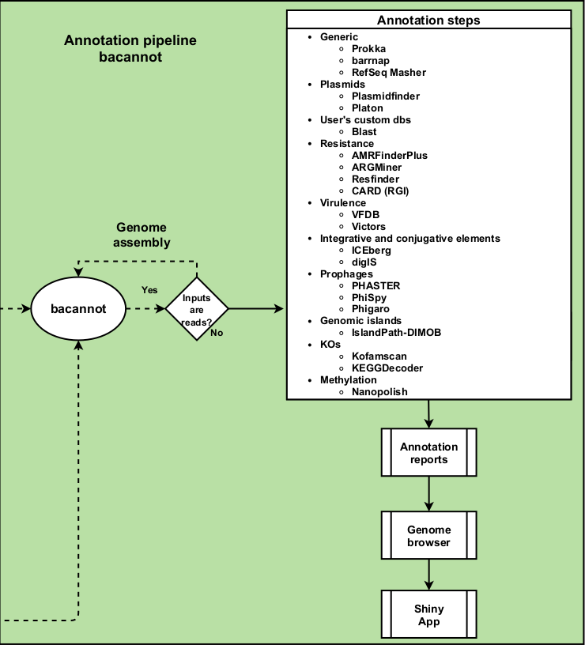

```{r setup, include=FALSE}
options(htmltools.dir.version = FALSE)
knitr::opts_chunk$set(
  fig.width=9, fig.height=3.5, fig.retina=3,
  out.width = "100%",
  cache = FALSE,
  echo = TRUE,
  message = FALSE, 
  warning = FALSE,
  hiline = TRUE
)
library(knitr)
library(icons)
# source: https://github.com/gadenbuie/xaringanExtra
#xaringanExtra::use_animate_css()
#xaringanExtra::use_animate_all("slide_down")
xaringanExtra::use_scribble()
xaringanExtra::use_search(show_icon = TRUE)
xaringanExtra::use_tachyons()
xaringanExtra::use_webcam()
xaringanExtra::use_freezeframe()
xaringanExtra::use_tile_view()
htmltools::tagList(
  xaringanExtra::use_clipboard(
    button_text = "<i class=\"fa fa-clipboard\"></i>",
    success_text = "<i class=\"fa fa-check\" style=\"color: #90BE6D\"></i>",
    error_text = "<i class=\"fa fa-times-circle\" style=\"color: #F94144\"></i>"
  ),
  rmarkdown::html_dependency_font_awesome()
)
xaringanExtra::use_fit_screen()
xaringanExtra::use_extra_styles(
  hover_code_line = TRUE,         #<<
  mute_unhighlighted_code = TRUE  #<<
)
```

```{r xaringan-themer, include=FALSE, warning=FALSE}
library(xaringanthemer)
style_duo_accent(
  primary_color = "#a3b6e1",
  secondary_color = "#445588",
  link_color = "darkblue",
  inverse_header_color = "#FFFFFF",
  header_font_google = google_font("Josefin Sans"),
  text_font_google   = google_font("Montserrat", "300", "300i"),
  code_font_google   = google_font("Fira Mono")
)
# colors
  # primary_color = light_yellow,
  # secondary_color = dark_yellow,
  # header_color = gray,
  # text_color = gray,
  # code_inline_color = colorspace::lighten(gray),
  # text_bold_color = colorspace::lighten(gray),
  # link_color = blue,
  # title_slide_text_color = blue,
```

class: middle

# Why?

* Next generation sequencing (NGS) has been successfully used in the context of infectious disease research of public health relevance
* A relatively new field is emerging: *Genomic surveillance*

    + Sequencing whole genomes from viral or bacterial pathogens 
    
      + Unprecedented resolution of pathogen genetic makeup
      
      + To identify outbreak origins and track transmissions
    
      + Investigate epidemic dynamics
      
      + Enables identification of virulence 

--

.bg-washed-blue.b--dark-blue.ba.bw2.br3.shadow-5.ph4.mt0[
This combination idea has been further reinforced with the ongoing genomic characterization in the context Sars-CoV-2 pandemics 
]


---

# However...

* Although of great relevance, the implementation of such practices remain a challenge in research and public health laboratories

* The overall analysis depends on bioinformatics skills and expertise:
    
    + Selection of sequencing platform

    + Selection and installation of tools and resources
    
    <!-- + Staff training -->
    
    + Preparation of data
    
    + Execution of analysis
    
    + Interpretation of results

--

.bg-washed-blue.b--dark-blue.ba.bw2.br3.shadow-5.ph4.mt0[
These may pose a great hindrance to the implementation of genomics routines
]

--

---

class: middle, center, inverse

# Thus, there is a pressing need for a comprehensive software solution 

---

# Container-based pipelines


.pull-left[
<br>
* In order to mitigate such hindrance, we developed three sequential pipelines:

    + `r fontawesome("github")` [ngs-preprocess](https://github.com/fmalmeida/ngs-preprocess)
    + `r fontawesome("github")` [MpGAP](https://github.com/fmalmeida/mpgap)
    + `r fontawesome("github")` [bacannot](https://github.com/fmalmeida/bacannot)

* Adaptable to different scenarios
    + With different combinations of data from the main sequencing platforms.
]

.pull-right[

]


---

# Implementation

.pull-left[
This container-based implementation leverages:

+ Portability
    + Dependencies are packed in `r fontawesome("docker")` conteiners which makes installation easy:
    + `docker pull <image>`
+ Reproducibility
    + Nextflow ensures the execution of the pipeline for different datasets
+ Scalability
    + Nextflow provides easy parallelization and implementation of pipelines in any machine, from laptops to HPCs
+ Error "tolerance"
    + Nextflow tracks each process and provide checkpoints and clear error messages for easy pipeline "restart" in case of errors.
]

.pull-right[

**Distribution**

* Pipelines are available in github `r fontawesome("github")`
* Tools are available in docker images `r fontawesome("docker")` 


]

---

# Easy installation and execution

.pull-left[

* Pipelines are executed in a single command.

    + Parameters can be given as CLI arguments but config files are recommended.

```bash
nextflow run fmalmeida/ngs-preprocess -c config.txt
```


]

.pull-right[
* Config file template

<br>

]

---

# Bacannot, the annotation pipeline

.pull-left[
* Bacannot was designed to be comprehensive!

    + But also modular
        
        + analyses can be skipped by user
    
    + From one to thousand genomes at once
    
    + Nice reports and a web app for results exploration

* Since it is based on modules, it can rapidly adapt to the community:
    
    + New reports
    + New analyses
    + Etc.
]

.pull-right[
<center>

</center>
]

---

# Bacannot outputs: HTML Reports

* Example: AMR report

<center>

</center>

---

# Bacannot outputs: Genome browser

* All annotation available in the browser

<center>

</center>

---

# Bacannot outputs: web (shiny) app

* A web-app to query the results

<center>

</center>

---
class: inverse, middle, center

# Thanks!
