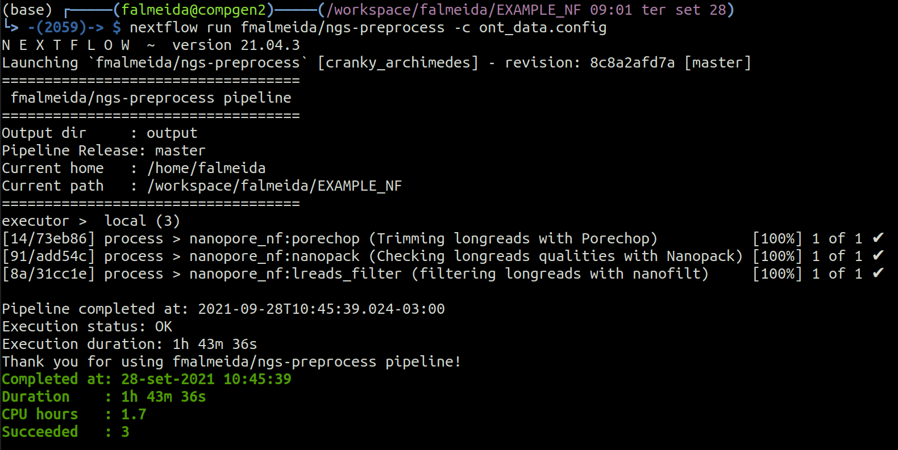

```{r setup, include=FALSE}
options(htmltools.dir.version = FALSE)
knitr::opts_chunk$set(
  fig.width=9, fig.height=3.5, fig.retina=3,
  out.width = "100%",
  cache = FALSE,
  echo = TRUE,
  message = FALSE, 
  warning = FALSE,
  hiline = TRUE
)
library(knitr)
library(icons)
# source: https://github.com/gadenbuie/xaringanExtra
#xaringanExtra::use_animate_css()
#xaringanExtra::use_animate_all("slide_down")
xaringanExtra::use_scribble()
xaringanExtra::use_search(show_icon = TRUE)
xaringanExtra::use_tachyons()
xaringanExtra::use_webcam()
xaringanExtra::use_freezeframe()
xaringanExtra::use_tile_view()
htmltools::tagList(
  xaringanExtra::use_clipboard(
    button_text = "<i class=\"fa fa-clipboard\"></i>",
    success_text = "<i class=\"fa fa-check\" style=\"color: #90BE6D\"></i>",
    error_text = "<i class=\"fa fa-times-circle\" style=\"color: #F94144\"></i>"
  ),
  rmarkdown::html_dependency_font_awesome()
)
xaringanExtra::use_fit_screen()
xaringanExtra::use_extra_styles(
  hover_code_line = TRUE,         #<<
  mute_unhighlighted_code = TRUE  #<<
)
```

```{r xaringan-themer, include=FALSE, warning=FALSE}
library(xaringanthemer)
style_duo_accent(
  outfile = 'xaringan-themer.css',
  primary_color = "#a3b6e1",
  secondary_color = "#445588",
  link_color = "darkblue",
  inverse_header_color = "#FFFFFF",
  header_font_google = google_font("Josefin Sans"),
  text_font_google   = google_font("Montserrat", "300", "300i"),
  code_font_google   = google_font("Fira Mono")
)
# colors
  # primary_color = light_yellow,
  # secondary_color = dark_yellow,
  # header_color = gray,
  # text_color = gray,
  # code_inline_color = colorspace::lighten(gray),
  # text_bold_color = colorspace::lighten(gray),
  # link_color = blue,
  # title_slide_text_color = blue,
```

class: middle

# Why?

* Next generation sequencing (NGS) has been successfully used in the context of infectious disease research of public health relevance
* A relatively new field is emerging: *Genomic surveillance*

    + Sequencing whole genomes from viral or bacterial pathogens 
    
    + Unprecedented resolution of pathogen genetic makeup
      
    + To identify outbreak origins and track transmissions
    
    + Investigate epidemic dynamics
      
    + Enables identification of virulence

???

* NGS data is being successfully used for the study and control of infectious diseases which is giving rise to a relatively new field called *Genomic surveillance*.

* The pillars of this filed is that the massive genome sequencing of pathogens enable the identification of outbreaks sources, track transmissions, investigate epidemic dynamics, investigate resistance and virulence traits, and more.

* All of that because of the high resolution genetic makeup of the pathogens provided by sequencing.

--

.bg-washed-blue.b--dark-blue.ba.bw2.br3.shadow-5.ph4.mt0[
This idea is being currently reinforced with the ongoing genomic surveillance performed during the Sars-CoV-2 pandemics 
]

---

# However...

* Although of great relevance, the implementation of such practices remain a challenge in research and public health laboratories

* The overall analysis depends on bioinformatics skills and expertise:
    
    + Selection of sequencing platform

    + Selection and installation of tools and resources
    
    + Preparation of data
    
    + Execution of analysis
    
    + Interpretation of results

.bg-washed-blue.b--dark-blue.ba.bw2.br3.shadow-5.ph4.mt0[
These pose a great hindrance to the implementation of genomics routines in clinical settings
]

???

* However the implementation of such practices in clinical settings are still a challenge because it heavily depends on bioinformatics skills and expertise, such as:

* Selecting the right sequencing platform
* Prepare the input data, analyse it and interpret the results in practical information and solutions

---

class: middle, center, inverse

# Thus, there is a pressing need for a comprehensive software solution

???

Therefore, there is a urgent need for a comprehensive solution that mitigates such hindrance.

---

# Container-based pipelines

.pull-left[
<br>
* In order to mitigate such hindrance, we started in 2018 to develop three sequential pipelines:

    + `r fontawesome("github")` [ngs-preprocess](https://github.com/fmalmeida/ngs-preprocess)
    + `r fontawesome("github")` [MpGAP](https://github.com/fmalmeida/mpgap)
    + `r fontawesome("github")` [bacannot](https://github.com/fmalmeida/bacannot)

* Adaptable to different data scenarios
    + Accepting different combinations of data from the main sequencing platforms.
]

.pull-right[

]

???

In order to address this need, we developed three sequential pipelines that together (point to them in the image) provide a comprehensive workflow for raw data preprocessing, genome assembly and bacterial genome annotation.

All that adaptable to different scenarios, meaning that users can use different combinations of data from Illumina, Pacbio and Nanopore sequencing platforms.

---

# Implementation

.pull-left[
This container-based implementation leverages:

+ Portability
    + Dependencies are packed in `r fontawesome("docker")` containers which makes installation easy:
    + `docker pull <image>`
+ Reproducibility
    + Nextflow ensures the execution of the pipeline for different datasets
+ Scalability
    + Nextflow provides easy parallelization and implementation of pipelines in any machine, from laptops to HPCs
+ Error "tolerance"
    + Nextflow tracks each process and provide checkpoints and clear error messages for easy pipeline "restart" in case of errors.
]

.pull-right[

**Distribution**

* Nextflow pipelines are available in github `r fontawesome("github")`
* Tools are available in docker images `r fontawesome("docker")` 


]

???

* The pipelines were implemented in Nextflow and all the tools are wrapped inside docker containers, which makes distribution and installation be quick and easy, only being required to download the pipeline from github and the docker images from dockerhub.

* Moreover, since the pipelines are implemented in nextflow, they are:

    + Extremely reproducible, meaning nextflow will ensure the same execution for different datasets
    
    + Highly scalable because nextflow provides easy parallelization of jobs and easy portability to clusters, meaning the pipelines can be easily used in any machine, from laptos to HPCs, from 1 to 1000s samples.

---

# Easy installation and execution

.pull-left[

* Pipelines are installed (if necessary) and executed in a single command.

    + Parameters can be given as CLI arguments but config files are recommended.

```bash
nextflow run fmalmeida/ngs-preprocess -c config.txt
```



]

.pull-right[
* Config file template

<br>

]

???

* Here we can see how simple it is to use the pipelines!

    + The command `nextflow run` will download the pipeline if not already available and execute it!

* All parameters can be set via the command line, however it is easier and cleaner to use the configuration file which is exemplified in the image on the right. This is the simplest way to configure and use the pipelines.

---

# Bacannot, the annotation pipeline

.pull-left[
* Bacannot was designed to be comprehensive!

    + But also modular
        
        + analyses can be skipped by user
    
    + From one to thousand genomes at once
    
    + Nice reports and a web app for results exploration

* Since it is based on modules, it can rapidly adapt to the community:
    
    + New reports
    + New analyses
    + Etc.
]

.pull-right[
<center>

</center>
]

???

* To exemplify one of the pipelines, I will discuss the implementation of the annotation pipeline.

* Bacannot is a comprehensive annotation pipeline which performs various types of annotations steps, from CDS and rRNA prediction, to focused annotation and detection of plasmids, genomic islands, prophages, integrative and conjugative elements, virulence and antimicrobial resistance genes, and more.

* Although comprehensive, the pipeline is modular, meaning that users can skip annotation steps if desired.

* Which also makes the it highly adaptable to the community needs, meaning that new steps and modules can be rapidly added because it does not require changes in the whole pipeline.

* All that while providing nice alternatives for results visualization and interpretation, such as: HTML reports, a genome browser, and a web app for a compact way of exploring and querying the results

---

# Bacannot outputs: HTML Reports

* Example: AMR report

<center>

</center>

???

* All that while providing nice alternatives for results visualization and interpretation, such as: HTML reports

* Here I show you the AMR report which have a tab summarizing the results of each specific tool.

---

# Bacannot outputs: Genome browser

* All annotation available in the browser

<center>

</center>

???

* A genome browser which wraps up all the results obtained with the pipeline providing a beautiful way to visualize and investigate th results.

---

# Bacannot _outputs_: web (shiny) app

.pull-left-bigger[

]

.pull-right-smaller[
* Indexation of annotation reports

* Genome Browser navigation

* Interrogation fo results stored in SQL

* Dynamic BLAST:

    + Tabular-like to identify positions and intersections with annotation
    
    + For alignment visualization with [SequenceServer](https://sequenceserver.com/)
]

???

* And also a a web app for a compact way of exploring and querying the results.

* Here we can see different tabs which list all the HTML reports, a tab for querying the results stored in a SQLdb so users can rapidply filter and interrogate their data and a tab providing a way to BLAST your input and visualize whether the BLAST results intersect with the annotations results produced with the pipeline.

---
class: inverse, middle, center

# Thanks!
